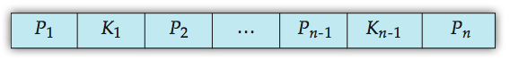

B+ Tree Node Structure
----------------

- K(i) are the search-key values 
- P(i) are pointers to children (for non-leaf nodes) or pointers to records or buckets of records (for leaf nodes).

Leaf Nodes in B+ Trees
-------------

Leaf Node 는 Increasing Order 로 정렬되어있으며, 
한 마지막 Key 의 Pointer 는 다음 형제 Node 의 첫번째 Key 를 가르킨다. 
 
위의 그림처럼 모든 Leaf Node 들의 고유 Pointer 는 file record 를 가르킨다.
 
B+ Tree 의 모든 Key 값은 Leaf Node 에 존재하며 Internal Node 에 존재하며  Leaf Node 에 존재하지 않는 Key 값도 존재할 수 있다. 
--> Key 값 삭제시 Leaf Node 에서만 삭제하기 때문에 삭제된 Key 값이더라도 Internal Node 에 존재할 수 있다.

Non Leaf Nodes in B+ Trees
-------------

All the search-keys in the subtree to which P(n) points have values greater than or equal to K(n–1)

Example B+ Trees
------------

- Leaf Node 는 반드시 3개 이상 5개 이하의 Key 값을 가져야함. ( A leaf node has between [(n−1)/2] and n–1 values )
- Root Node 를 제외한 Non Leaf Node ( Internal Node ) 는 반드시 3개 이상 6개 이하의 Child Node 를 가져야함. ( Each node that is not a root or a leaf has between [n/2] and n children )
- Root Node 는 2개 이상의 Child Node 를 가져야함. ( If the root is not a leaf, it has at least 2 children. )
