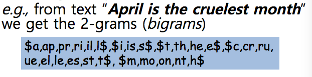

Wild - Card Queries
==========
### - " * " / " $ "

* " * " means 0 or more occurrences
* " $ " represents the end ( m$ : m 으로 끝남 , $m : m 으로 시작함 )

Example
<pre>
mon* : find all docs containing any word beginning with "mon"
</pre>
Easy with Binary tree ( or B+ Tree ) lexicon ( 사전 ) : retrieve all words in range : mon <= w < moo
<pre>
*mon : find words ending in "mon" : harder
</pre>
Maintain an additional B+ Tree for terms backwards

### - Query Processing

- At this point, we have an enumeration of all terms in the **Dictionary** that match the wild-card query
- We still have to look up the postings for each enumerated term

Example
<pre>
se * ate
se *  AND * ate : This may result in the execution of many Boolean AND queries.
</pre>
--> Expensive ( B+ Tree 를 하나 더 사용하게 된다 ) 

Solution : **Transform wild-card queries so that the " * " occur at the end** 

This give rise to the **Permuterm Index**

### - Permuterm Index

<pre>
From term hello, index under :
- hello$ , ello$h, llo$he, lo$hel, o$hell, $hello 
( 한칸씩 Shifting 하면서 해당 단어에 대한 Permuterm 을 전부 만든다 )
</pre>

**해당 Word 에 대해 모든 Permuterm 을  Dictinary 에 넣고 Search 시 사용한다.**

<pre>
Search H * llo
- hello -> llo$he, ...
- hillo -> llo$hi, ...
- haaallo -> llo$haaa, ...
--> 미리 Dictionary 에 정의된 단어들의 Permuterm 들 중 Search word 가 match 되는 것을 찾는 방식
</pre>

Exercise
<pre>
1. Write down the entries in the permuterm index dictionary that are generated by the term mama.
- ANS :  mama$, ama$m, ma$ma, a$mam, $mama
2. If you wanted to search for s*ng in a permuterm wildcard index, what key(s) would one do the lookup on?
- ANS : ng$s *
3.
 - Consider again the query fi * mo * er.
 - What Boolean query on a bigram index would be generated for this query?
 	- ANS : The Boolean query is $f AND fi AND mo AND er AND r$.
 - Can you think of a term that matches the permuterm query, but does not satisfy this Boolean query?
 	- ANS : The "filibuster" term will match the permuterm query, but does not satisfy this Boolean query
</pre>

### - Bigram ( k - gram ) Indexes

- Enumerate all k - grams ( sequence of k chars ) occuring in any term

- $ is a special word boundary symbol
- **Maintain a second inverted index from bigrams to dictionary terms that match each bigram**

Example
<pre>
he * llo
- he -> hello, he, she, loche, ...
- lo -> hello, location, log, loche, ...
Check match he * lo ---> hello, loche, ...
</pre>

### - Processing wild - cards
- Query mon * can now be run as **$m AND mo AND on**

- Gets terms that match AND version of our wildcard query
- **But we may enumerate moon too!**
	- Must post-filter these terms against query.
	- Or positional index can handle this problem
- Surviving enumerated terms are then looked up in the term-document inverted index
- Fast, space efficient ( Compared to permuterm )
- As before, we must execute a Boolean query for each enumerated, filtered term
- Wild-cards can result in expensive query execution (very large disjunctions...)